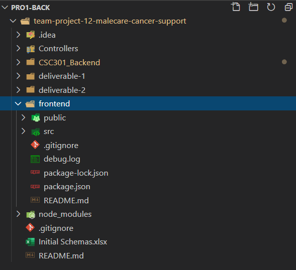
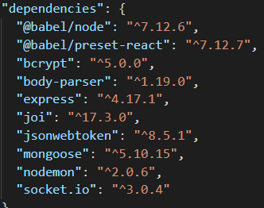
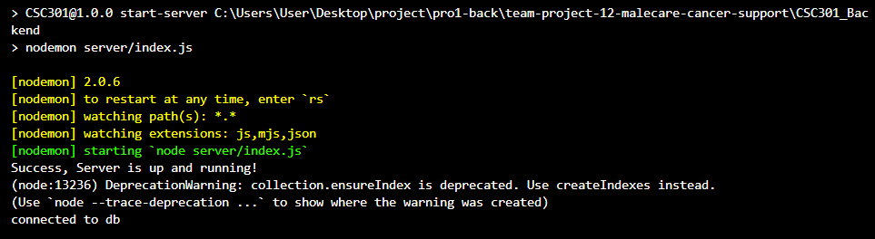

# CANCERCHAT by TEAM 12

## Description 
 
 We are planning to build a web application CancerChat that will help cancer patients/survivors connect with each other based on the personal data they provide. 
Cancer doesn’t only affect someone's physical health but also takes a toll mentally and emotionally. This life-changing diagnosis and the exhausting treatment that comes after it can induce feelings like anxiety, distress, depression, and loneliness.

Therefore, to solve this problem we are making an app that will help cancer patients/survivors find a partner to date or a mentor to consult (maybe both!!). Cancer patients/survivors are in a unique position to understand and empathize well with other cancer patients/survivors, being able to fully understand how a cancer diagnosis and treatment thereafter can take a toll physically, mentally, and emotionally; currently, there is no widespread platform for cancer patients to meet and connect with each other in these capacities.
Our goal is to improve their mental health through which we can improve their treatment, physical health, and the life ahead. With our application, cancer patients can process their cancer diagnosis, treatments, and rest of life with others who have similar experiences.

## Key Features

**1. Login and registration**
###### LOGIN

This is the login page that will allow a user with an account to login with the correct details. The text font size is larger than usual to make it easier for those undergoing treatments that affect their vision capacities to view. Users who successfully login are redirected to the landing page.
If a user uses incorrect details to login (invalid email or invalid email and password combination), the following message will be prompted to advise the user:

If the user doesn’t have an account on CancerChat, they can create one by clicking on the “Sign up now!” link below the login button.

###### REGISTRATION

When the user clicks on sign up, they will be taken to a registration page where they have to fill out a form which asks them various questions regarding their personal information as well as questions regarding their cancer diagnosis and treatment. We use this information to match the users with each other and to provide them with necessary notification/guidance with their cancer treatment. Once the form is complete and the register button is clicked, the user is redirected to the landing page and a new user is stored in the database.

**2. Matching Algorithm**

Once a user performs a successful login, they are directed to this landing page: this page displays all the users that could be potential matches for the current user, one at a time. The potential match's profile information is displayed on the page, with some personal information, an picture, and a section where they can write about themself.
Our matching algorithm returns these potential matches by filtering them on two conditions:
* Filter by the users who liked you - so all the other users that wanted to connect with you would show up first
* Filter by location - this filter will limit the number of users and show only those users that are close to the current user

On each potential match's profile, a user can click on either the "pass" or "connect" button based on whether they are interested in connecting with the user. Clicking on "pass" means that the current user will not see the passed user as a potential match recommendation in the future, while clicking on "connect" queues up the current user in the other user's poential match recommendation queue. After clicking on one of the buttons, the next potential match is displayed on the page (if there are no more potential matches, a message is displayed on the page).

**3. Navigation Bar for accessibility**

On the matching page (as well as the Profile and Chats pages), if a user clicks on the navigation button on the top left (indicated by three lines), they can access the navigation bar.

In this menu in the open navigation bar, you can see the current user with their name and profile picture, a Home button which will take the user back to the landing page (where potential matches are shown), a Profile button which will take the user to their own profile page, a Chats button which will open a chatting page where the user can see all the users they connected with and chat with them, and a Logout button which they can use to logout of the application.
This navigation bar was designed so that it also can be easily used to navigate on mobile devices with smaller screens.
 
**4. In-app Chatting**

Once two users are matched (both of them press "connect" on each other), they will show up on each other’s respective chatting page which can be accessed by pressing the Chat button in the navigation bar.

	In this example, both Uttkarsh Berwal and gordon ramsay pressed "connect" on each other and they showed up on each other’s chat page.

On the chatting page, clicking on a user displayed there will open an interface where the two users can chat easily. A user can exit this conversation interface by clicking on the "Exit" button in the top right corner.

In the chat window you can privately have conversations with that user: you can view past messages in the middle portion of the screen, and send message by typing in a message and clicking the "Send" button in the bottom right corner.

**5. The Profile Page**

This page will show the current user how their profile will appear to other users when the current user appears in others' match recommendations. (This can be extended in the future to update the user's profile as well.)

**6. Notifying the users of new medicines and treatments (Admin Access)**

For the admin purposes, as requested by our client, we made an admin page that will allow the admin to get the emails of all the users matching critera based on filters, in a CSV format. This feature will allow admin to email relevant users about any upcoming or new changes in their treatments, about new trial treatments, or about new medicines in the market.

Here one can easily filter users by dragging the age range slider or using the dropdown menus (the dropdown menus allow typing to quickly find items), and then click on "Generate email list." After a response from the server is received, text indicating how many users matched the filters appears, as well as a "Download Email List File" button which when clicked prompts the user to save the filtered users' emails as a CSV file.

## Instructions
 
Watch this demo to know about the app in detail. (https://play.library.utoronto.ca/b70571f42f95f757c89cdb984caa9a8d)

1. Use this link [https://cancerchat.herokuapp.com/](https://cancerchat.herokuapp.com/) to open the website (note that the free Heroku server being used for development right now takes around 5 seconds to load initially).

2. You will be taken to the homepage of the website where you can choose from the two options to login as an existing user or sign up a new user.

3. Login and Signup
* Case 1. If you already have an account, login using the email and the password that you set.
* Case 2. If you don’t have an account, click on the blue sign up link below the login button to register a new user. Clicking on the link will take you to the registration page; fill out the registration details and press register to create a new user.
  We have created 10 fake users on the website for testing purposes; their emails are as follows (all of these accounts have the password `12345678`):
    - `jonathan.woods@gmail.com`
	- `ronald.trump@gmail.com`
	- `cindy.brown@gmail.com`
	- `otula.white@gmail.com`
	- `red.rose@gmail.com`
	- `chad.bundy@gmail.com`
	- `callum.scott@gmail.com`
	- `greg.harold@gmail.com`
	- `karen.dell@gmail.com`
	- `gordon.ramsay@gmail.com`

4. Successful login and signup will both take you to the landing page, which displays your potential matches. On this page you will see the users who want to connect with you and the users that are close to you (distance in kms) in that order. Then as the current user, you can press "connect" or "pass" on these recommended matches based on their profiles.
* Case 1. If you press "pass," the user will be removed from your matching carousel and you will be shown the next recommended match.
* Case 2. If you press "connect," it will put you in the top priority of the other user when they login and look at their matching page.  
If there are no more potential matches, a message starting with "There are no more matches..." will be displayed.
(For the purpose of this course we have only created a small number of fake users, so certain users might only have a small number of recommeded matches, e.g. 1 or 2.)

5. On the top left of the landing/matching page, there is a navigation button (three horizontal stripes). If you click on that button it will show you 4 items in the menu:
* Item 1. The name and profile picture of the current user, that is, you
* Item 2. The Home button which will take you to the landing/matching page
* Item 3. The Profile button which will take you to the profile page. Here the user can view their own profile.
* Item 4. The Chat button which will take you to the chatting page where you can see all the users that you are connected with
* Item 5. The logout button for logging out of the account
  You can try clicking on the Home, Profile, and Chat buttons to navigate between pages.

6. Once two users have successfully connected with each other, they will show up on each other’s chatting page which can be accessed from the navigation bar.
On the chatting page, once you click on any of the users, it will open a chatting interface where you can privately chat with the other user by typing your message and hitting "Send." Click on the "Exit" button on the top right of the chatting interface closes the interface. You can see the chatting feature in action by logging in as two different matched users (might have to have each user in a different browser/browser session) and sending messages--for testing purposes, users `jonathan.woods@gmail.com` and `gordon.ramsay@gmail.com` are set up to be matched with each other already.

7. The last feature is for the admin of our client's organization, which can be accessed using this route for now. (https://cancerchat.herokuapp.com/admin)
On this page you can use a number of filters and click on the "Generate" button to generate an email list. It will show you how many users match your set filters, and if there is at least one user that matches your filters, a new button will be displayed that upon clicking will prompt you to download a CSV file of the emails of all the users matching your filters.
These emails can be used to send important messages to the users about new and upcoming advances in cancer treatments.
(this feature was implemented upon request by the partner after our demo, so it is not behind admin login yet)

 
## Development requirements
 
### Frontend Development
1. Ensure that Node.js (and `npm`) is installed on the system
(https://nodejs.org/en/download/); we used Node versions 12 or 14.
 
2. The Developer should also have a code editor/IDE (for example, VS Code) and cloning the files from the Github repository (https://github.com/csc301-fall-2020/team-project-12-malecare-cancer-support.git).

3. Open a terminal and navigate to the `frontend` folder (in the root directory of the repository) and open the terminal.

4. Run the command `npm install` in the `frontend` folder to ensure the following dependencies are installed:

	
5. Start the React development server with the command `npm run start` in the terminal in the `frontend` folder. The app will open up in a browser tab; any saved changes to the frontend code files will trigger a restart of the app with the new changes.
 
### Backend Development
1. Ensure that `yarn` is installed on the system
(https://classic.yarnpkg.com/en/docs/install).

2. Ensure that MongoDB is installed on the system
(https://www.mongodb.com/).

3. Then after cloning the files from the repository (https://github.com/csc301-fall-2020/team-project-12-malecare-cancer-support.git), open a terminal and navigate to the `CSC301_Backend` folder (in the root directory of the repository) and open the terminal.

4. Run the command `yarn install` in the `CSC301_Backend` folder to install the following dependencies:

	
	
5. Run the command `yarn start-server` in the terminal in the CSC301_Backend folder. This will start the development server on your local system at the port 5000.
	
(you should get a message of “Success, Server is up and running!” if the server starts without an error and “connected to db” after that if you are connected to the MongoDB.)
Any saved changes to the backend code files will trigger a restart of the app with the new changes.

Note: the files `usersinfo.json` and `chatsinfo.json` in the `CSC301_Backend` directory can be used to initialize the Mongo database, as well as reset the database after changes are made in the app (eg pressing "connect" or "pass" on users)

 
## Deployment and Github Workflow
 
When we decided to split the team for the backend and the frontend, we also decided that we would separate out the branches for backend and frontend in order to avoid conflicts and have the backend and frontend somwhat independent while developing. We started by branching off the master into two separate branches, one for frontend and one for backend. The frontend branch is called “frontend-develop” and the backend branch is called “frontend-connect”. We always tried to keep the merges in one direction, from frontend-develop to frontend-connect. This is also the reason why we chose the above mentioned names because everytime frontend code was first developed on “frontend-develop” and then connected to the backend using “frontend-connect” where we could view a working application by running the code locally. At that point, we could choose to deploy the changes to Heroku; we usallly only manually deployed to Heroku after a team meeting, since most of us made small commits and were constantly making improvements and fixes to the code, and the Heroku deployment process for our app took quite a bit of time.
In addition to these branches, whenever it was possible we chose to work on a new branch for a new feature which made the workflow as smooth as possible.
Mostly of the pull requests were made by Rutav and Uttkarsh where they reviewed it together. The other merges were made on group meetings where everyone could review it. We chose this particular workflow to improve the efficiency, save time, and avoid conflicts when we all combine our code.

## Licenses 

We are applying the open-source code License called MIT to our codebase.
 
MIT license is a short and simple permissive license which allows other users to freely use our code, make changes and modify it, but they have to include a copy of the same license when they are distributing the software. It will not affect development of our original code in any way but will allow coders from all over the community to borrow ideas from our code and even contribute to our code if they want to. 
The MIT license falls under the permissive (or BSD-style) of FOSS licenses. BSD-style licenses allow any user to do anything with the code granted they provide attribution and don’t claim any liability in the future.

Our partner did not have much information about the licenses, so we made the decision of choosing this license after informing him. We made this particular decision because this will allow any future CSC301 teams to work on our project and extend our code without any restrictions. 
This license is also really flexible with other licenses, so if the client wants to switch to a more restrictive/proprietary license one day, they can easily apply that license on top of this one.

