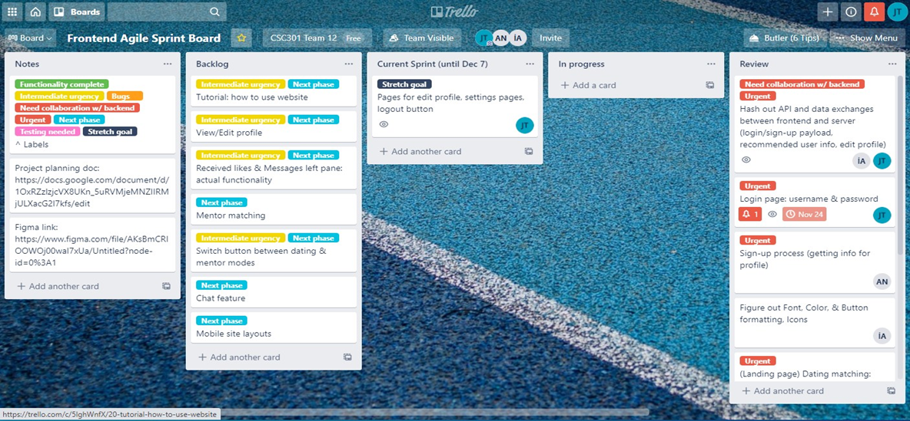

# CANCER CHAT by TEAM 12

 > _Note:_ This document is meant to be written during (or shortly after) your review meeting, which should happen fairly close to the due date.      
 >      
 > _Suggestion:_ Have your review meeting a day or two before the due date. This way you will have some time to go over (and edit) this document, and all team members should have a chance to make their contribution.

## Iteration XX - Review & Retrospect

 * When: 18th Dec 2020 and the project presentation with partner on 8th Dec 2020
 * Where: Zoom Meeting

## Process - Reflection

#### Q1. Decisions that turned out well

List **process-related** (i.e. team organization and how you work) decisions that, in retrospect, turned out to be successful.

 * 2 - 4 decisions.
 * Ordered from most to least important.
 * Explain why (i.e. give a supporting argument) you consider a decision to be successful.
 * Feel free to refer/link to process artifact(s).
 ##### Answer
 1. Having separate chats for frontend and backend

During the early stages of development, we only had one group “CSC301 4.0 Gang”. Discussing all the different features and details of the web application was getting too clustered between the six of us. Therefore, we decided to separate out the work between three different chats -
* The main group “CSC301 4.0 Gang”
* Backend Dev “CSC301 4.0 BackEnd Gang”
* Frontend Dev “CSC301 4.0 Frontend Gang”

This decision turned out well because it helped us save a lot of time and made many complex discussions easier. We were then able to communicate more efficiently.

2. Making a Taskboard

After assigning different tasks to different members, we were pretty sure that we would complete every task smoothly, but that wasn’t the case. When we actually started working on different features, we realised that there were many tasks that were dependent on each other, that is, some tasks needed to be finished before starting the next one. This halted the progress for many members multiple times.

To overcome this problem we decide that we should make separate task boards for the frontend and backend team, and work in unison on sorting that task board. Using these task boards gave us a clear idea of our progress in relation to other members, and helped us to prioritize our tasks accordingly.

3. Always working in Pairs

The other decision that turned out to be well was working in pairs whenever possible. We decided that at a time whenever we are working on a feature at least two members would be online for making decisions and writing code. The division of different pairs and the times that we would work in was decided separately for frontend and backend tasks. Amongst the different pairs, our working methods sometimes included pair programming on a video call or just staying online for discussing things in a continuous flow. 

This decision helped us save some time in decision making and we were able to write code with minimal errors. It not only helped the members to get familiar with each other but also helped understand each other’s code better.

#### Q2. Decisions that did not turn out as well as we hoped

List **process-related** (i.e. team organization and how you work) decisions that, in retrospect, were not as successful as you thought they would be.

 * 2 - 4 decisions.
 * Ordered from most to least important.
 * Explain why (i.e. give a supporting argument) you consider a decision to be unsuccessful
 * Feel free to refer/link to process artifact(s).

##### Answer
1. Meeting every week

When we got paired with our partner, we were all excited to work on this project for both personal and professional reasons. We knew that communication is important for this project to be successful, but as the time passed we faced multiple challenges as a group and in our individual lives as well. Our decision of meeting every week on a zoom call did not turn out as well as we hoped because university life made it near impossible.

Almost everyone in our team was taking 6 courses, which made it difficult to allocate time every week for a single course. On top of that, mid-semester, one of our members got Covid. But at the end, we believe this course helped us improve our time management skills. 
 
2. Having no Hierarchy 

When we started the project we thought that it would be better for us to work together, instead of maintaining a Hierarchical structure within our group. We decided that there should be no single person assuming the position of a manager/leader/spokesperson, instead we should all just directly communicate with each other all the time. 

(imagine that each circle represents a member)
This decision turned out to be way worse than expected because no one was able to keep up with all the details of the project and we faced multiple instances where we missed out on some major details/features. This led to confusion amongst the members and wasted a lot of time and effort.

3. Splitting the team into two halves

One of the other naive decisions that we made during Deliverable 1 was to split the team into two halves, backend and frontend. This decision seemed to be quite fair when we started working but as the project progressed we realised that the backend tasks were comparatively heavy and required more support. For our website, the backend development involved things like making a matching algorithm and an in-app chatting feature on top of the other APIs used for authentication and storing user data. By the time we realised our mistake, we had already wasted a lot of time. When we tried to shift one member from the frontend to backend, it took extra time for that member to get familiar with backend code. Therefore, the decision to split the team into two halves was not a good idea.

 

#### Q3. Planned changes

List any **process-related** (i.e. team organization and how you work) changes you are planning to make (if there are any)

 * Ordered from most to least important.
 * Explain why you are making a change.
 
 ##### Answer
 1. Two members looking over backend and frontend
 
As mentioned before, we were facing multiple problems due to the lack of structure within our group. To solve this problem, we came to a conclusion that there would be two members looking over the backend and frontend separately. These two members would head the backend and frontend team, and keep the other members within their own teams posted about any details that are essential to maintain a fluid workflow.

These two members are also responsible for communicating with each other and share details that are required to integrate the backend and the frontend efficiently. We planned this change to improve our speed and save time.

(circles are team members and wires are communication links)

2. Instead of abandoning regular meetings, leaving comments on Google docs and taskboard

Meeting every week was near impossible for our group. Everyone had their individual life problems to deal with that we didn’t take into account, but we also realised that exchange of information still needs to be better. Therefore, we are planning to leave more comments in the code, the shared google docs, and the taskboard for our team members. We decided to make our comments as elaborate as possible so that when the other person starts working on a task related to yours, they can easily analyze where you left off and continue working from there.

3. Allocating more time to Retrospect 

Another change that we want to include is allocating more time to retrospect about teams progress and problems. We will talk about challenges that halted our progress and how we can make the process more smooth.
The main idea behind it is asking these three questions - 
* What went well - We will discuss the progress we have made and some key decisions that helped us complete certain tasks.
* What could have been improved - We will discuss the tasks that were raising a lot of errors.
* Actions to be taken - After talking about both of the above mentioned things, we are going to brainstorm how we can do things even better.

## Product - Review

#### Q4. How was your product demo?
 * How did you prepare your demo?
 
 For our demo, we created a small powerpoint presentation which helped us explain our progress, our decisions, and our product. Along with a presentation, we used zoom meetings to practice our demonstration, in which one person would share his screen and explain the features of the app on their local system.

 
 * What did you manage to demo to your partner?
 
 Our product is a dating/mentorship social networking website. We managed to demo the login and registration page, the chatting feature, and the matching algorithm that we created. 

 
 * Did your partner accept the features?
 
 Our partner was very happy with features that we presented. He was impressed with the chatting feature and the fact that we included all the right questions that he asked for on the registration page.
 
 
 * Were there change requests?
 
 Although the partner was very impressed with the features, he wanted us to improve the aesthetics of the website a bit. He also requested a separate admin page for the website that would help him send personalised information about the new medicines in the market for his users.
 
 
 * What did you learn from the demo from either a process or product perspective?
 
 The key fact that we learned from the demo is that if we didn’t have this iteration in our product development then we might not have met the clients' needs to our best level. This demo served as a progress check with our partner and helped us to retrospect and change our methods of working. It is better to have iterations/demos like this so that we can improve efficiently to make the best product meeting our clients needs.

 
 * *This section will be marked very leniently so keep it brief and just make sure the points are addressed*

