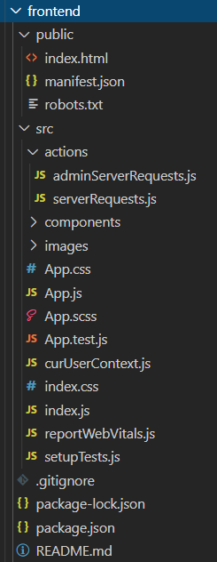

# Frontend Documentation

See our README file in the root directory of the repository for instructions to set up a development environment for the frontend, along with more information about the functionality of the app.

## Code directory structure
The frontend is a React app created using Create React App. All frontend code is located in the `frontend` directory (which can be found in the root directory of the Github repository)

The directory structure is the same as the one set up using Create React App (see [https://create-react-app.dev/docs/folder-structure](https://create-react-app.dev/docs/folder-structure) for more information about Create React App’s directory structure).

Notes:
- Code files are in the `src` folder and are organized as follows:
    - The `actions` folder contains all server calls to our backend
    - The `images` folder contains icons used in our app
    - The `components` folder contains all React components we used in the app. Each component is in its own subdirectory inside `components`; each subdirectory contains all files relevant to that component, such as a JavaScript and CSS file with the same name as the component. Note that an `index.js` is in each component subdirectory that just exports the actual component JavaScript file; this is to allow components to be more easily imported in other files, while keeping the main code of each component with unique filenames.
    - Files directly in the `src` folder that we used are `curUserContext.js` and the files starting with `App.*`. `App.js` is the entry point to the React app.
- We do not have a favicon yet.

## Dependencies

The dependencies we used can be found in the `package.json` file. Noteworthy dependencies:
- We used `bootstrap`, specifically `react-bootstrap`, for layout and styling elements
- We used `node-sass` to enable modifying Bootstrap styling with SASS
- We used `axios` for server calls
- `socket.io-client` is used in the chatting feature
- Many of the other dependencies are for specific Components used in various views

## Component overview
- `App`: The entry point of the React App. Initializes the user context and login cookie, and defines the routes used by the app.
- `Admin`: Used by organization admins only; generate (by a server call) a list of emails of users matching the filters selected on the page, and provide a button to download the emails as a CSV file.
    - Accessed at `/admin`
- `Chat`: The page for displaying a chat with id `chatId` between two users: the page displays messages, the other user’s name and profile image, and the input control for sending messages. The component uses `socket-io.client`, so there is bidirectional communication between a client and the server (i.e., new messages dynamically display for both users, users do not need to refresh the page). The component changes the color scheme depending on type of the chat (e.g., if the chat is for dating the color scheme is magenta, while if the chat is for mentorship the color scheme is blue). The user can exit the page by clicking on the exit icon on the top right, which redirects the user to the chats page.
    - Accessed at `/chat/:chatId` (Private route, requires user login to access)
- `Chats`: The page for displaying current chats of the user. For each chat, the other user’s name and profile image is displayed. The component uses `socket-io.client`, so there is bidirectional communication between a client and the server, so chats are dynamically added to the page whenever two users are matched (no need to refresh the page). Each chat’s color scheme depends on on type of a chat (e.g., if the chat is for dating the color scheme is light red, while if the chat is for mentorship the color scheme is blue). 
    - Accessed at `/chats` (Private route, requires user login to access)
- `GeoSearchBar`:  The component which represents a search bar that is used to search for cities around the globe. The search bar uses the API provided by Teleport.org for searching for cities (the API is free and public, however Teleport.org asks to notify them if one plans to make thousands of requests in a day). When clicking the search button, the search bar provides a list of possible cities from which a user can select from (the user can only select one city at a time). By selecting a city from the list, the search bar stores information about the selected city (e.g, name of the city, latitude of the city). 
    - Used in `Registration` component
- `HomePage`: The home page of the app, contains a background image as well as two buttons, one for sign up and one for login.
    - Accessed at `/home` or `/`
- `Landing`: The page a user lands on upon login or registration; currently displays the matching page, as its main content
    - Accessed at `/landing` (Private route, requires user login to access)
- `Login`: The page for a user to log in by an email and password (there is a link to the registration page).
    - Accessed at `/login`
- `Matching`: Component for displaying potential matches (currently the main content of the Landing page). Fetches potential matches from the server; a potential match’s profile information is displayed on the page, as well as two buttons “pass” and “connect” to move to the next potential match.
    - Used in `Landing` component
- `NotFound`: The page rendered when the user enters an invalid URL
    - Accessed at a URL not defined in `App.js`
- `PrivateRoute`: Only allow access to the route passed in as props if the user is logged in.
    - Used in `App` component (in file `App.js`)
- `Profile`: Display the current user’s profile, in the format it would appear to other users in the app.
    - Accessed at `/profile` (Private route, requires user login to access)
- `Registration`: The page for someone to register an account; it requires the person to enter their email and name, choose a password, enter some personal information, as well as information related to their cancer type and treatments.
    - Accessed at `/register`
- `SideBar`: The component is a sidebar menu that opens and closes from the left side of the screen. It provides several options to navigate the app, including links to the Landing page, the Profile page, and the Chats page, as well as a logout button. The current user’s name and profile picture is displayed in the sidebar as well.
    - Used in `Chats`, `Landing`, and `Profile` components

## Some useful links for reference
- Intro to React bootstrap: [https://react-bootstrap.github.io/getting-started/introduction/](https://react-bootstrap.github.io/getting-started/introduction/)
- Intro to React context: [https://reactjs.org/docs/context.html](https://reactjs.org/docs/context.html)
- Intro to react-cookie (library for cookies): [https://github.com/reactivestack/cookies/tree/master/packages/react-cookie](https://github.com/reactivestack/cookies/tree/master/packages/react-cookie)
- Socket.io: [https://socket.io/](https://socket.io/)
